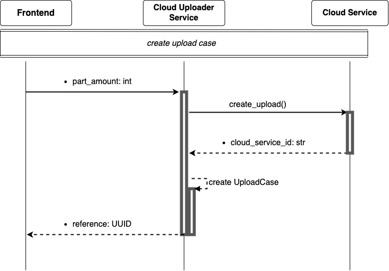
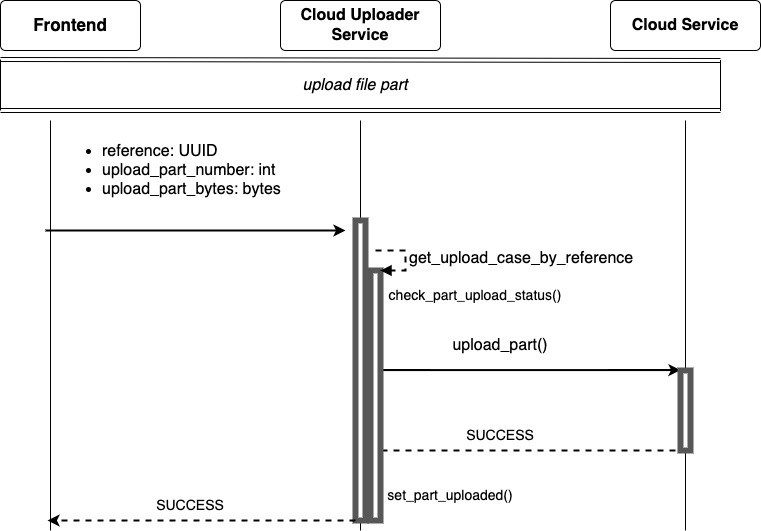
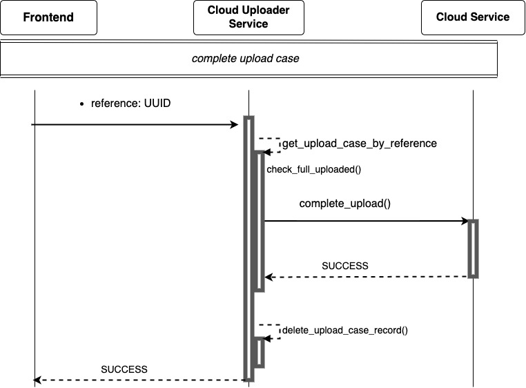
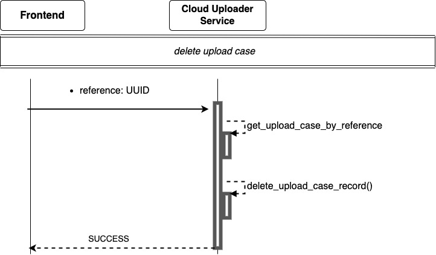

# Cloud Uploader Service

### Сервис загрузки файлов в облачное файловое хранилище

Данный сервис предназначен для загрузки файлов больших объемов в облачное хранилище с ускорением
достигающимся многопоточной загрузкой разделенного на части файла.

### Структура проекта по директориям:

- **src**
  - ***cloud_uploader_service*** - основная директория проекта, содержащая компоненты сервиса.
- **tests** - тесты покрывающие компоненты сервиса.
- **fake_cloud_service_client** - фейковый клиент облачного сервиса имитирующий процесс загрузки файла с помощью блокировки потока на заданное время.

#### Описание компонентов сервиса:

- **adapter** - содержит класс адаптирующий интерфейс клиента облачного хранилища.
- **api** - модуль run проводит сборку всех компонентов и запускает сервис.
- **domain** - компонент содержащий модель сущности загрузочного случая ***UploadCase***, 
а так же _**use cases**_ модели, компонент концентрирует бизнес логику приложения.
- **gateway** - REST API сервис.
- **service_layer** - компонент необходимый для запуска use cases.
- **storage** - компонент с сервисом конкретной базы данных и модуль ***repository*** 
необходимый для сохранения и сборки сущности загрузочного случая.
- **bootstrap** и **bootstrap_external_services** - модули предназначенные для сборки
всех компонентов для дальнейшего запуска сервиса.
- **settings** - модуль для подгрузки конфигурационных параметров.

### Диаграммы Use Cases и описание 

- Создание нового загрузочного случая
  - создает загрузку в облачном сервисе
  - создает сущность загрузочного случая
  - возвращает идентификатор загрузочного случая

`POST` `/create_upload_case`

___

___

- Загрузка файла
  - находит в базе данных загрузочный случай по идентификатору
  - проверяет не загружена ли уже переданная часть файла
  - загружает в облако переданную часть файла
  - устанавливает статус загруженной части файла

Данный use case запускается в отдельном потоке для одновременной загрузки нескольких частей.

`POST` `/upload_file_part`

---

---

- Завершение загрузки
  - находит в базе данных загрузочный случай по идентификатору
  - проверяет загружены ли все части файла
  - завершает загрузку в облачном сервисе
  - удаляет запись загрузочного случая из базы данных

`POST` `/complete_upload_case`

___

___

- Удаление записи загрузочного случая в случае отмены
  - находит в базе данных загрузочный случай по идентификатору
  - удаляет запись загрузочного случая из базы данных

`POST` `/delete_upload_case`

___

___

- Переменные окружения хранятся в файле .env, в корневой директории проекта src/cloud_uploader_service.

### Список переменных окружения

| Name                        | Description                  |
|:----------------------------|:-----------------------------|
| REDIS_URL                   | Адрес Redis                  |
| CLOUD_SERVICE_USERNAME      | Username облачного сервиса   |
| CLOUD_SERVICE_PASSWORD      | Password облачного сервсиа   |
---

